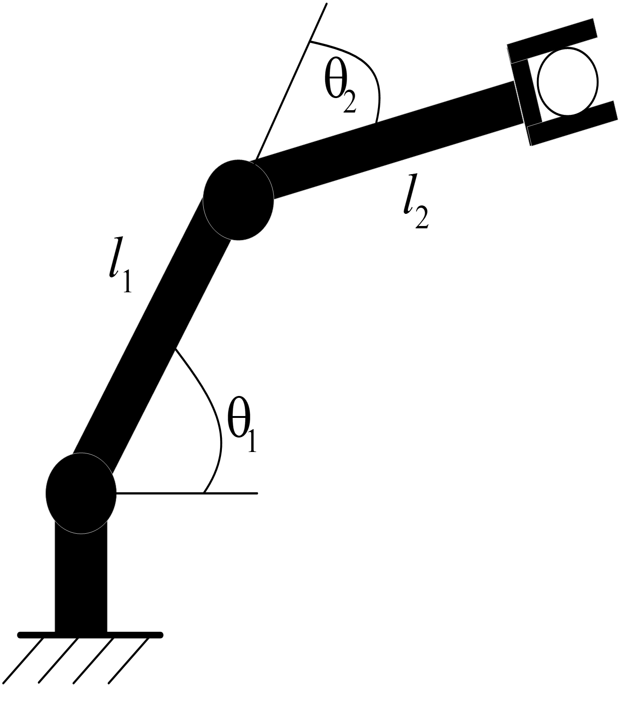
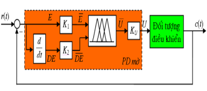
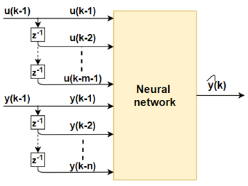
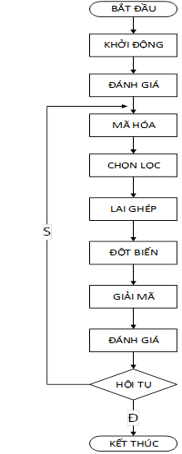
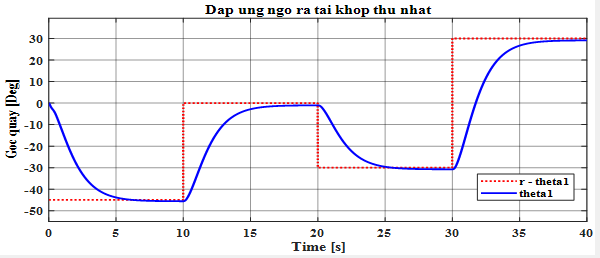
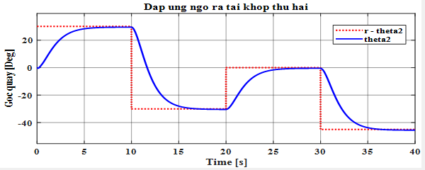
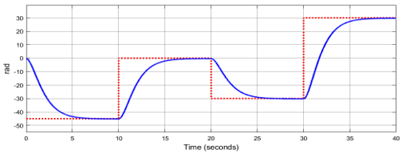
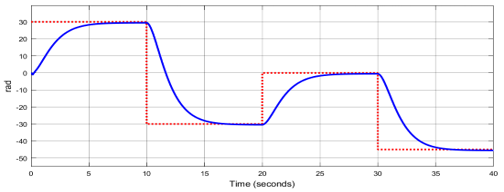
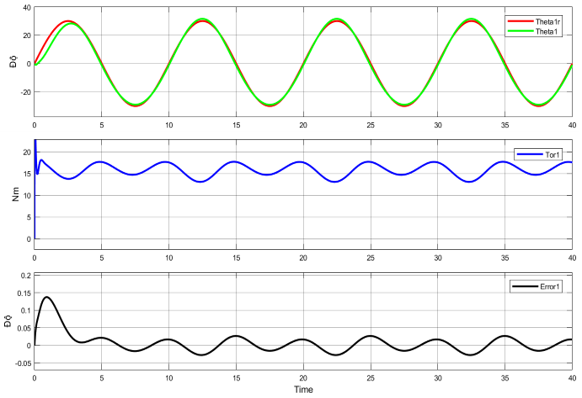
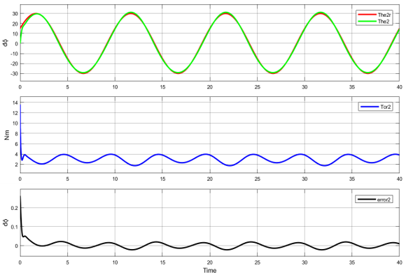

 <h1 align="center">Intelligent Control System</h1>

# Introduction
This project implements modeling of a 2-degree-of-freedom robotic arm system. Then design fuzzy PD controller, design neural network approximating fuzzy controller and use GA algorithm to determine optimal PID controller parameters.

# Modeling of a 2-DOF robotic arm 
2-DOF robot model is given as shown below:

   
  <i>Robot 2-DOF</i>

The parameters of 2-DOF robot are presented in this file **Final_project.pptx**.

# Fuzzy Logic (FL)
The object of controlling the robot with 2 degrees of freedom is a MIMO system, but we use the SISO fuzzy controller according to the decoupling principle, each fuzzy controller will control the operation for each joint of the Robot.

   
  <i>PD Fuzzy controller</i>

# Neural Networks (NN)
The neural controller is created based on the signal transmission and processing mechanism of the human brain. The construction of the neural controller is to create an artificial neural network that mimics the working process of the human brain. The essence of an artificial neural network is a distributed parallel computing network.

   
  <i>Predictive neural network model</i>

# Genetic Algorithm (GA)
Genetic Algorithm (GA) is an algorithm that searches for the optimal solution on the principle of guesswork according to the evolutionary process and genetic laws of organisms in nature. In genetic algorithms for optimization problems, the idea is that a set of chromosomes in individuals will be allowed to evolve toward a selection of progressively better solutions.

   
  <i>Genetic Algorithm Flowchart</i>

# Simulation results
Output response of joints (left picture is joint 1, right is joint 2).

* **Fuzzy Logic:**

  
  

* **Neural Networks:**

  
  

* **Genetic Algorithm:**

  
  

# Video Design intelligent controllers for a 2-DOF manipulator
https://youtu.be/SbA-9qXNue8
